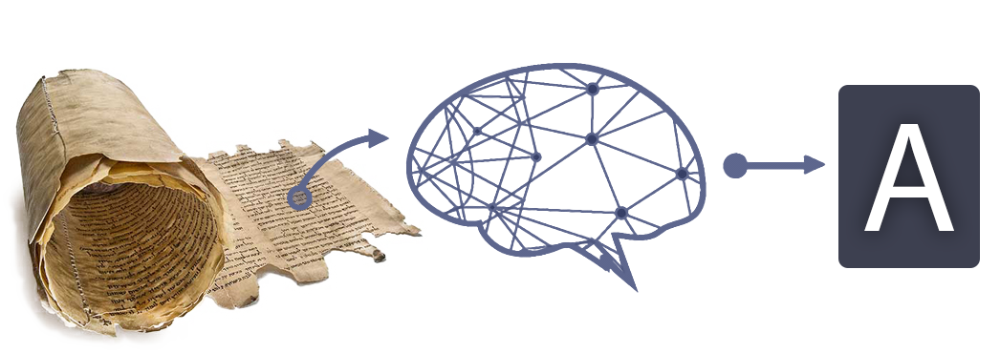

# In Codice Ratio - OCR with CNN
**Deep learning** experiments and library for the OCR of **In Codice Ratio**, part of a project involving an artificial intelligence that can process document from **Vatican Secret Archives**.

**In Codice Ratio** (ICR) is a project curated by **Roma Tre University** in collaboration with **Vatican Secret Archives**. This project has the purpose of digitalizing the contents of documents and ancient texts from the Archive.

The problem we faced in this repository wes just a part of ICR, basically its core. We had to classify handwritten characters in [Carolingian minuscule](https://en.wikipedia.org/wiki/Carolingian_minuscule) starting from an image of that character. The input is an ensemble of possible cuts of the word that has to be read, and our system has to be able to decide if a cut is correct and, if it is, which character it is. 

### Example

* Bad cut of the word "asseras", recognized as "----s"

 

* Good cut of the word "asseras", recognized as "asseras"

Other parts of ICR include a segmentation software, that is used to find words in a document and provide possible letter cuts to the OCR, and a **Language Model** to discriminate false positives among cuts classified by the OCR. The dataset is provided via a crowdsourcing platform. Those parts are not included in this repository.
