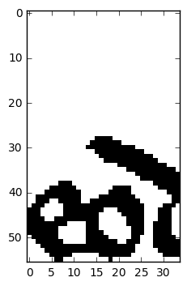
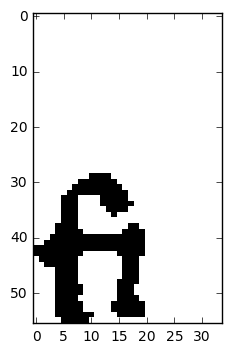
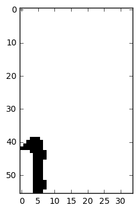
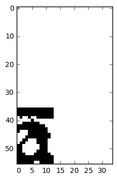

# OCR tramite reti neurali convoluzionali per il progetto In Codice Ratio

# Il problema

**In Codice Ratio** (ICR) è un progetto curato dall'*Università degli Studi di Roma Tre* in collaborazione con l'*Archivio Segreto dello Stato del Vaticano*. Tale progetto ha lo scopo di digitalizzare i documenti e i testi antichi contenuti nell'Archivio.

Il problema che abbiamo affrontato è solo una parte di ICR, ed è quello di classificare le lettere scritte a mano (in scrittura carolina) a partire dalla loro immagine opportunamente estratta, al fine di riconoscerle. L'input sarà un insieme di possibili tagli delle parole da leggere. Il nostro sistema dovrà essere in grado non solo di riconoscere le lettere contenute in un buon taglio, ma anche di scartare i tagli errati non riconducibili ad alcuna lettera in modo da non fornire troppe possibilità errate al language model.

Per affrontare tale problema abbiamo scelto di utilizzare il Deep Learning, costruendo più Convolutional Neural Network, studiando le migliori architetture allo stato dell'arte e riadattandole per questo contesto.

# L'ambiente

Il sistema si basa sulla libreria open-source [**TensorFlow**](https://www.tensorflow.org/), gestita ad alto livello tramite la libreria [*Keras*](https://keras.io/).
Per ottenere migliori prestazioni, utilizziamo la versione di Tensorflow per GPU, con supporto per Cuda core (cuDNN v5.1).

Gli esperimenti sono stati svolti su 3 macchine diverse messe a disposizione dai membri del gruppo, tutte e tre in ambiente Windows con processori Intel e GPU Nvidia dotate rispettivamente di 384, 1024 e 1664 Cuda core. La prima GPU con 16 GB di shared memory, le altre 2 con rispettivamente 2 GB e 4 GB di dedicated memory. 

Windows è stato preferito ad un sistema Unix per la miglior gestione del carico di lavoro sulla GPU, dal momento che è possibile escludere la UI del sistema operativo dalla GPU dedicata e farla elaborare alla GPU integrata sui processori Intel. Il codice utilizza comunque librerie compatibili con Linux e Mac OS. 

## Il primo modello di CNN e il test dell'ambiente di lavoro

Il primo modello di CNN prodotto è una rete piuttosto semplice, impostata per verificare il corretto funzionamento del sistema.
Si tratta di una rete a 2 livelli convoluzionali e 2 hidden layer. 

# Multi-column Deep Neural Network

I modelli successivi si basano principalmente sullo studio del 2012 condotto da Dan Ciresan, Ueli Meier e Jurgen Schmidhuber ed esposto nel paper [Multi-column Deep Neural Network for image recognition](http://people.idsia.ch/~ciresan/data/cvpr2012.pdf). 

A seguito di un attento studio, abbiamo sperimentato il loro approccio e riadattato alla luce delle nuove evidenze emerse nel campo delle reti neurali: in primo ruolo [DropConnect](http://cs.nyu.edu/~wanli/dropc/) e la funzione di attivazione Rectifier.

## La rete MCDNN

Il modello è costituito da diverse *colonne* di Deep Neural Network, tutte con la stessa struttura, le cui predizioni vengono successivamente combinate in una semplice media aritmetica (approccio **ensemble learning**).

La singola DNN ha la seguente struttura: 

Il training parte da pesi inizializzati randomicamente, e la tecnica del max pooling permette di determinare facilmente i neuroni più attivi per ogni regione di input. I neuroni così "selezionati" proseguono nell'allenamento, mentre gli altri non subiscono ulteriori correzioni nei pesi.

Le immagini di input vengono preprocessate a monte del training, e successivamente vengono distorte attraverso operazioni di rotazione, traslazione e scaling all'inizio di ogni epoca di addestramento, sempre in maniera randomica. Le immagini originali vengono invece usate in fase di validazione. Il preprocessamento può inoltre essere diverso per ogni colonna, in modo da ridurre sia il tasso d'errore che il numero di colonne necessarie a raggiungere un certo livello di accuracy.

Il training termina quando l'errore sul validation set arriva a zero, o quando il tasso di apprendimento raggiunge un minimo prestabilito.

Il modello ha inoltre una forte base biologica, essendo ispirato alle reali connessioni presenti tra la retina e la corteccia visiva nei mammiferi.

### Esperimenti

Il modello è stato testato su diversi dataset conosciuti, con opportuni adattamenti determinati dalla natura del dataset stesso (dimensione, formato, ecc...).

L'esperimento sul quale ci confrontiamo è proprio quello su dataset **MNIST**, i cui risultati sono il nostro punto di riferimento.

Il dataset originale viene normalizzato rispetto a 7 diverse dimensioni in pixel, generando così 7 diversi dataset. Per ognuno di essi, si allena una rete multicolonna formata da 5 DNN semplici, ottenendo una rete multicolonna finale di 35 DNN. 
L'allenamento si svolge per 800 epoche. Ogni DNN impiega all'incirca 14 ore di addestramento, con scarsi miglioramenti oltre le 500 epoche.

Il *tasso d'errore* (definito banalmente come 1-precision) è dello 0.23% per la rete multicolonna, il che rappresenta un enorme traguardo per lo stato dell'arte nel 2012, battuto solo di recente.

Per quanto riguarda la singola DNN, il *tasso d'errore* sale allo **0.4%**: sarà questo il nostro punto di riferimento.

## Il secondo modello di CNN

Siamo quindi partiti dall'architettura proposta nel paper, e abbiamo apportato alcune modifiche dettate dalle nuove evidenze emerse negli ultimi anni.

La prima sostanziale modifica al modello è stata quella di aggiungere due livelli di **Dropout**. Questi livelli ci permettono di settare una certa frazione casuale delle unità di input a 0 ad ogni iterazione della fase di training, evitando così di incorrere in overfitting.

La seconda riguarda la funzione di attivazione. Nel modello multicolonna viene utilizzata la *tangente iperbolica*, simile alla sigmoide logistica ma in range [-1, 1] invece di [0, 1]. Il nostro esperimento è stato quello di sostituire questa funzione con la **rectifier**. I vantaggi di questa sostituzione sono diversi: la ReLU è molto semplice da calcolare (richiede solo addizioni, moltiplicazioni e confronti), permette un'attivazione sparsa dei neuroni (evita l'overfitting), e una migliore propagazione dei gradienti. Semplicemente, risulta più veloce ed efficiente della sigmoide per architetture deep e dataset complessi.

### Valutazione su dataset MNIST

I risultati ottenuti hanno confermato quanto detto: la funzione ReLU risulta più efficiente e ci concede migliori valori di accuracy (0.9934 contro 0.9906 ottenuto da tanh). 

Il numero di epoche è invece risultato eccessivo, portando la rete a fare overfitting. Alla luce di ulteriori test, un numero migliore sarebbe intorno alle 56. Anche in questo caso, la ReLU ha mostrato un comportamento migliore rispetto tanh, che invece degrada già intorno alle 40 epoche. Visto il guadagno in precision ottenuto con 800 epoche, rispetto al tempo necessario, riteniamo che sia poco conveniente.

Il *tempo d'addestramento* è di **6 secondi** ad epoca su una GPU (GTX960ti con 2 GB) con 1024 cuda core, per cui impiega circa *un'ora e 10 minuti* per 800 epoche.

Il *tasso d'errore*, in fine, è dello **0.55%**: risulta migliore rispetto al primo modello di rete, ma ancora non raggiunge il valore di riferimento.

## Il terzo modello con distorsione

Seguendo l'esempio della MCDNN, abbiamo deciso di introdurre una **distorsione** delle immagini all'inizio di ogni epoca di training. Le operazioni di distorsione applicate sono della stessa tipologia di quelle usate per la MCDNN, ovvero si tratta di rotazioni (in una finestra di 40°), traslazioni (verticali e orizzontali del 10%) e scaling (del 10%), eseguite randomicamente a partire da un seed.

Il training viene eseguito inoltre in due tempi: inizialmente sulle immagini distorte, e in un secondo tempo sulle immagini originali, per avere qualche bias sulle immagini non deformate.

Come ulteriore esperimento, abbiamo deciso di modificare la dimensione dell'hidden layer, portandolo da 150 a 200, supponendo che tale dimensione fosse dettata da motivi computazionali.

Il terzo modello di CNN è dunque il seguente:

### Valutazione

La divisione dell'addestramento in due fasi, tra immagini distorte e immagini originali, ci mostra già buoni risultati: notiamo infatti che tra la prima e la seconda fase si ha un incremento dello 0.15% in precision.

L'addestramento richiede chiaramente tempi più lunghi con questa architettura: notiamo infatti una dilatazione dei tempi per ogni epoca, passando da 6 secondi a **20** sulla nostra GPU media (GTX960). Il *tempo* totale per completare il training è stato di **4 ore**.
Ciò nonostante, il *tasso d'errore* scende considerevolemente da 0.55 a **0.45**, a parità di numero di epoche.

L'aumento della dimensione dell'hidden layer inoltre ha portato un lieve miglioramento del tasso d'errore, raggiungendo lo **0.44**.

Si tratta di un buono risultato, molto vicino a quanto ottenuto dalla DNN semplice del paper.

## Il quarto modello multi colonna

In questo modello si applica la tecnica dell'**ensemble learning**, così da avvicinarsi all'architettura completa esposta nel paper.

Per semplicità, abbiamo costruito una rete di 5 colonne anche se, come già spiegato, nel paper viene costruita una rete più complessa, con 7 reti da 5 colonne, addestrate su diverse alterazioni del dataset. Il fine dell'esperimento è comunque quello di capire se  possiamo trarre un effettivo vantaggio dall'ensemble learning, per cui va bene utilizzare una rete più piccola ma che ci permette di comprimere i tempi di addestramento.

### Valutazione

I *tempi* di addestramento sono proporzionali al numero di reti che costituiscono la multicolonna, non avendo la possibilità di parallelizzare il processo sul nostro attuale hardware. Il tempo impiegato è stato dunque di **12 ore** sulla nostra GPU migliore (GTX970ti con 4 GB). Per un confronto con le reti precedenti, riportiamo che con la nostra GPU media avrebbe impiegato all'incirca 16 ore.

Il *tasso d'errore* è migliorato, raggiungendo lo **0.4**. Si tratta del miglior risultato ottenuto, e ci conferma quanto espresso dal paper, ovvero che la tecnica dell'ensemble learning offre effetivamente prestazioni migliori. Notiamo inoltre che abbiamo ottenuto un risultato analogo rispetto alla 5 MCDNN del paper lavorando sulle immagini in dimensione originale, la quale ottiene un tasso d'errore identico.

Aggiungendo un numero adeguato di colonne e con le opportune trasformazioni del dataset sembra quindi essere possibile raggiungere i risultati pubblicati dal paper, ovvero quello 0.23% che tanto si avvicina all'errore umano dello 0.2%.

# Esperimenti sul dataset di In Codice Ratio
Per affrontare il problema proposto abbiamo costruito e sperimentato su 3 diverse architetture. 
Rispetto alle architetture usate per MNIST abbiamo ridotto la finestra della distorsione delle immagini (30° massimi di rotazione e zoom di massimo 10% con shift del 5%) a causa dela natura del dataset, preprocessato per avere le lettere in un angolo dell'immagine, con lettere molto simili tra loro poichè scritte da amanuensi. 
Di seguito riportiamo i modelli e i risultati degli esperimenti. 

## Classificatori binari per singolo carattere
L'architettura a 5 colonne con layer 30C-50C-200N è stata usata per condurre due diversi esperimenti sulla costruzione del training set, con un rapporto tra esempi positivi e negativi prima di 1:1 e poi di 1:2. Il *tempo di addestramento medio* sulla GPU migliore è stato di **18 minuti** per la rete con rapporto 1:1, e di **28 minuti** per quella 1:2, impiegando rispettivamente *6:30 ore* e *10 ore* per l'addestramento di tutte e 22 le reti.

Dalla **valutazione** sono risultati dei livelli d'accuracy e tassi d'errore distribuiti piuttosto uniformemente tra i diversi caratteri, quasi sempre sotto l'8% d'errore, sebbene troviamo alcune significative eccezioni.
Lettere particolarmente difficili da distinguere sono state la **'i'**, la **'m'**, la **'n'**, la **'u'** e la **'h'**. Intuiamo che buona parte del problema, in generale anche per le altre lettere, sia posto nell'etichettatura del dataset, che contiene diversi errori commessi nella fase di crowdsourcing: vediamo infatti negli esempi di classificazione incorrette che molto spesso si trattava di immagini riconosciute correttamente dalla rete ma etichettate male nel dataset. Tuttavia la situazione si aggrava per lettere facilmente confondibili tra loro, che sono proprio la 'i', la 'm', la 'n' e la 'u', che nella scrittura carolina appaiono quasi come una concatenazione di 'i', o di corte linee verticali, distinguibili per lo più dal contesto e nel migliore dei casi dalla legatura del carattere alle lettere successive e precedenti. Per la **'h'** il problema è stato posto soprattutto dalla scarsità di esempi (circa 60).
Di seguito riportiamo i tassi d'errore relativi solo alle lettere problematiche:

Carattere | Ratio pos:neg 1:1 | Ratio pos:neg 1:2 | Esito
:--------:|:-----------------:|:-----------------:|:----:
     i    |       17,9%       |       17,5%       | -
     m    |        9,4%       |       10.3%       | +
     n    |       11,2%       |       12.9%       | +
     u    |       15,5%       |       15.8%       | +
s_mediana |        3.3%       |        6.6%       | +
     h    |       19,4%       |       13.8%       | -
     f    |          5%       |        7.5%       | +
**media** |      **7.2%**     |      **7.1%**     | -

Tutte le altre lettere hanno errori inferiori al 5%.
     
La tabella ci mostra come il tasso d'errore cambi in positivo o in negativo in base alla lettera e alla ratio del training set. Abbiamo inoltre calcolato l'errore medio commesso da tutti i classificatori allenati sui due diversi training set: per il rapporto **1:1** abbiamo un **tasso d'errore medio** del **7,2%**, mentre per il rapporto **1:2** del **7,1%**, influenzato probabilmente dal netto miglioramento dell'errore sulla 'h'. 

Le cause di questa altalenanza sono da ricercarsi probabilmente nell'etichettatura del dataset, che in certi casi mostra tagli errati come buoni esempi. L'ambiguità del dataset porta all'incostanza della classificazione, per cui per un migliore risultato è necessario un dataset ripulito. 

## Classificatore Multiclasse a 22 classi (OCR)
Questo modello si basa sull'architettura a 5 colonne con layer 50C-100C-250N e si tratta di un'unica rete a 22 classi. Poiché svolge un diverso task da quello dei classificatori binari, che distinguono le singole lettere dalle altre e dal rumore, questa rete non è utilizzabile da sola per risolvere il problema posto, ma verrà inserita in una pipeline per raggiungere lo scopo desiderato.
Il *tempo di addestramento* è stato di poco più di **4 ore** sulla GPU migliore, circa *7 ore* sulla GPU media.

La rete raggiunge il **95,1%** di **accuracy** e il **94,9%** di **recall**, con un **tasso d'errore** del **4,6%**. Ispezionando la matrice di confusione, si nota il buon comportamento della rete con poche eccezioni. I caratteri **'h'** e **'f'** vengono spesso scambiate rispettivamente con i caratteri **'b'** e **'s alta'**. Di seguito riportiamo i valori:

Carattere |         h         |         b
----------|-------------------|------------------
     h    |         3         |         13 
     b    |         0         |         80
     
Carattere |         f         |       s_alta
----------|-------------------|------------------
     f    |        14         |          5 
  s_alta  |        23         |         90

L'errore sembra nascere dalla carenza di buoni esempi di 'h' e 'f' nel dataset, per cui la rete tende a confondere queste lettere con i due caratteri che più somigliano. Non è da escludere la presenza di errori nell'etichettatura effettuata dal crowdsourcing, soprattutto per i caratteri 's' e 'f' che sono molto simili.

In generale ci aspettiamo che, come per i classificatori binari, una pulitura del dataset possa portare ad ancora migliori prestazioni e a risolvere questi casi particolari.

## Classificatore binario dei tagli (segmentatore)
Questo classificatore è stato pensato per essere usato in serie con la rete multiclasse e ha il compito di stabilire se un dato segmento rappresenta un buon taglio o no. Il training set è stato costruito a partire da un'unificazione del dataset delle lettere tagliate bene (formando la classe "good") con un dataset aggiuntivo di tagli troppo grandi o troppo piccoli per ogni carattere (formando la classe "wrong").
Abbiamo eseguito due esperimenti con due diverse architetture, una analoga a quella dei classificatori binari per singolo carattere (30C-50C-200N) ed una analoga a quella del classificatore multiclasse (50C-100C-250N).
Queste due reti hanno evidentemente diversi *tempi di addestramento*, che sono rispettivamente di circa **4** e **8 ore** sulla GPU migliore.

Il primo esperimento ha raggiunto un'accuracy del **93,4%** ed un tasso d'errore del **6,5%**. Questo risultato è stato raggiunto già dalla singola colonna del secondo esperimento, e ciò ci lascia intuire che il numero di caratteristiche da estrarre per questo task è più elevato.

Per rimediare alla tendenza della rete a individuare falsi negativi, in particolare nei casi di buoni tagli di lettere 'i', classificati come cattivi tagli di altre lettere quali 'm', 'n' e 'u', abbiamo riallenato la rete eliminando dagli esempi negativi gran parte dei tagli sbagliati che risultano molto simili a buoni tagli di 'i'. In questo modo siamo riusciti a mitigare leggermente questa tendenza, ottenendo un'accuracy del **93,7%** ed un tasso d'errore del **6,2%**. Ripulendo ulteriormente il dataset, ed eliminando tutto ciò che somiglia ad una 'i', non otteniamo comunque risultati migliori: le 'i' contenute nelle legature (ad esempio in 'fi') non vengono comunque riconosciute, mentre i tagli sbagliati vengono riconosciuti quasi tutti come 'i'.

## Pipeline
Abbiamo infine sperimentato 4 diverse pipeline per l'individuazione delle possibili lettere all'interno della parola. Ogni pipeline prende in ingresso una possibile lettera ottenuta da tagli della parola nei minimi locali e decide se si tratta di una lettera ed eventualmente offre una lista di possibilità.

* La prima pipeline utilizza solo i **22 classificatori binari** per decidere sia se il taglio è fatto bene, sia quale lettera è più probabile. Questa pipeline non permette un confronto preciso tra le probabilità delle lettere, poiché sono ottenute da dataset diversi.
* La seconda pipeline utilizza il **classificatore binario dei tagli** per stabilire se il taglio ha individuato una sola lettera e, in caso affermativo, utilizza il **classificatore multiclasse** per fornire una lista di possibilità. In questo caso la probabilità delle lettere è normalizzata dal softmax layer della rete neurale.
* La terza pipeline è un approccio ibrido ed usa i **22 classificatori binari** solo per decidere se il taglio è fatto bene o male (basta che vada bene ad uno solo dei classificatori) ed il **classificatore multiclasse** per ottenere le probabilità.
* La quarta pipeline utilizza, come la seconda, il **classificatore binario dei tagli** per riconoscere la segmentazione, e i **22 classificatori binari** per produrre un ranking delle possibili lettere.

Abbiamo dunque effettuato 3 esperimenti con 3 parole diverse, ogni parola tagliata sia bene che male (principalmente in minimi locali ma non sempre).

 

Abbiamo potuto constatare che le pipeline 1 e 3 si comportano in maniera simile per i tagli errati, giudicando quasi sempre in modo positivo il taglio. Al contrario la pipeline 2 individua correttamente tagli fatti male, giudicando positivamente solo tagli plausibili (ad esempio parte di una 'u' può essere tagliata per somigliare molto ad una 'i' e viene giudicata positivamente). La pipeline 4 ha un comportamento analogo.
Ad esempio per il taglio sbagliato di "asseras", la pipeline 1 offre come possibilità "sls-s", la pipeline 2 e 4 "----s", mentre la pipeline 3 "bld-s" (dove '-' indica che il taglio è riconosciuto come sbagliato). Ancor più clamoroso con "unicu" (una parola difficile che può essere tagliata in molti modi), le pipeline 1 e 3 classificano il cattivo taglio come "iuuci", mentre le pipeline 2 e 4 lo rifiutano quasi interamente e classificano come "-uu--". Analogamente per "beneficiu", dove le pipeline 2 e 4 riconoscono solo le lettere effettivamente tagliate bene, mentre le altre pipeline danno un falso positivo per "siiescii" e "biiefoii".

Per quanto riguarda  i tagli corretti, anche in questo caso l'opzione migliore si è rivelata essere la pipeline 2, alla pari con le pipeline 3 e 4, mentre la pipeline 1 risulta essere la peggiore. Ad esempio per la parola "beneficiu", l'assenza di una distribuzione di probabilità per le lettere, che è mescolata con la probabilità di un buon taglio, fallisce nel riconoscere la 'n', fornendo come classificazione più probabile "beuesiciu", mentre le altre 2 pipeline classificano più correttamente. La pipeline 4, pur riportando nel ranking le lettere giuste come la 'n' e la 'f', le classifica con uno score più basso, interpretando comunque la parola come "beues-ciu".

In generale abbiamo notato che le *pipeline 1 e 3* offrono molti *falsi positivi*, mentre le *pipeline 2 e 4* sono più robusta ed hanno problemi solo con alcuni *falsi negativi* quando si tratta delle 'i'. Il problema è stato individuato ed attribuito ad un numero elevato di "cattivi tagli" di 'm', 'n' ed 'u' identici ad una 'i', che quindi viene classificata spesso in modo negativo. Per bilanciare la classificazione e spostare l'ago verso i falsi positivi è stato necessario rimuovere lettere identiche alle 'i' dai tagli "too narrow" di 'm', 'n' ed 'u'. 

Di seguito è fornita una tabella che riassume gli esiti dell'esperimento.

Parola (taglio) | asseras (bad) | asseras (good) | unicu (bad) | unicu (good) | beneficiu (bad) | beneficiu (good) 
--- | --- | --- | --- | --- | --- | ---
Pipeline 1 (22bin) | sls-s | asseras           | iuuci | unicu | siiescii | beuesiciu / beneficiu 
Pipeline 2 (seg+ocr) | ----s | asseras | -uu-- | unicu | ---ef--- | benes-c-u / benef-c-u
Pipeline 3 (22bin+ocr)| bld-s | asseras | iuuci | unicu | biiefoii | benesiciu / beneficiu 
Pipeline 4 (seg+22bin)| ----s | asseras | -uu-- | unicu | ---ef--i | beues-ciu / beuef-ciu

La tabella mostra come la seconda pipeline sia la più efficace nel riconoscere i tagli negativi e comunque ottima per i tagli positivi, fatta eccezione di alcuni particolari tagli di 'i', per i quali è già stata individuata la causa dell'anomalia.

Per quanto riguarda i *tempi di esecuzione*, la pipeline 2 risulta essere la più efficiente, impiegando generalmente un ordine di grandezza di meno rispetto alle altre. Di seguito riportiamo i tempi e la media delle esecuzioni:

Parola (taglio) | asseras (bad) | asseras (good) | unicu (bad) | unicu (good) | beneficiu (bad) | beneficiu (good) | media
--- | :---: | :---: | :---: | :---: | :---: | :---: | :---:
Pipeline 1 (22bin) | 15.9 | 0.63           | 0.48 | 0.47 | 0.74 | 0.86 | 3.1
Pipeline 2 (seg+ocr) | 1.44 | 0.08 | 0.04 | 0.06 | 0.06 | 0.12 | 0.3
Pipeline 3 (22bin+ocr)| 0.50 | 0.71 | 0.51 | 0.51 | 0.73 | 1.06 | 0.6
Pipeline 4 (seg+22bin)| 0.13 | 0.64 | 0.20 | 0.46 | 0.30 | 0.81 | 0.4

## Test su una pagina di manoscritto

Per verificare l'effettiva capacità delle pipeline in una situazione di reale utilizzo, abbiamo sottoposto un'intera pagina di manoscritto, segmentata con l'attuale metodo, alla classificazione di tutte e 4 le strutture. Poiché si tratta di una pagina non etichettata, non abbiamo modo di calcolare in maniera rigorosa delle metriche di valutazione; ciononostante possiamo osservare il comportamento dei diversi modelli per certe situazioni che già avevamo notato nell'esperimento precedente, ovvero riguardo ai tagli errati e alle legature.

Come già osservato, notiamo che le pipeline 1 e 3 hanno difficoltà nello scartare i tagli errati, per cui esempi come quelli riportati sotto vengono classificati come caratteri corretti.

 
 

Il primo esempio è un taglio troppo largo e viene classificato dalle pipeline 1 e 3 come s mediana, mentre le pipeline 2 e 4 riconoscono il taglio cattivo al 100%.

Il secondo esempio è proprio il caso di una legatura 'fi': le pipeline 1 e 3 ancora una volta lo identificano come un taglio buono, la prima classificando come 's mediana', la seconda come 'f'; mentre le pipeline 2 e 4 riconoscono il taglio errato al 85%.

Per quanto riguarda i tagli buoni, tutte le pipeline hanno un comportamento piuttosto buono, riuscendo a classificare bene i caratteri. Come esempi di buoni tagli portiamo due casi particolari per evidenziare due comportamenti.

 
 

Il primo esempio riporta il taglio buono di una 'i'. Tutte le pipeline lo riconoscono correttamente come 'i', con una probabilità variabile dal 92 al 99%. Proponiamo questo esempio per evidenziare il miglioramento in particolare della rete segmentatrice nel riconoscere correttamente le 'i' e a non misclassificarle come tagli errati di altre lettere, generando molti falsi negativi come avveniva prima del riaddestramento.

Il secondo esempio riporta un buon taglio di 'a', ma in una forma sconosciuta alle reti perché non presente nel dataset. Si tratta di una 'a' nel cui taglio troviamo un tratto orizzontale derivante da una 't' precedente o successiva. In questo caso, le pipeline 1 classifica correttamente la lettera 'a' al 90%, mentre la pipeline 3 classifica il taglio come corretto per la 'a' ma classifica la lettera come 'e'. Le pipeline 2 e 4 classificano invece il taglio come errato, che è molto più facile da correggere attraverso l'uso di un language model a posteriori, rispetto ad un carattere classificato per un altro (i.e. 'e' in luogo di 'a').

Esempi del genere non sono attualmente presenti nel dataset, per cui il comportamento anomalo non stupisce: situazioni simili, come quelle che occorrono anche per le legature, saranno risolte ampliando il dataset con questo tipo di esempi.

Quanto apprendiamo da questo esperimento non è altro che una conferma a quanto già riportato prima: la pipeline 2 si rivela essere la più efficace e efficiente, in quanto i tempi di esecuzione sono gli stessi riportati nell'esperimento precedente. Le pipeline 1 e 3 sono soggette a molti falsi positivi e classificano quasi sempre allo stesso modo, sebbene la pipeline 3 abbia un miglior ranking. Le pipeline 2 e 4 sono entrambe molto più robuste ai falsi positivi, tuttavia cedono sporadicamente ad alcuni falsi negativi. Questi piccoli errori possono essere corretti utilizzando una seconda rete serie (la pipeline 3), oppure affidandosi al language model costruito appositamente per questo progetto.

Abbiamo etichettato manualmente un campione di 100 tagli della pagina *048r*, sul quale tutte le pipeline hanno incluso nel ranking la lettera corretta, con una precisione del 100% sul campione. 
Tuttavia, includendo fra le etichette anche i tagli errati, la precisione cambia. Le pipeline 1 e 3 hanno ottenuto una precisione del 25%, con moltissimi falsi positivi, le pipeline 2 e 4 invece hanno ottenuto una precisione dell’80%, con la pipeline 2 ad avere il ranking più accurato nel 100% dei casi, mentre la 4 ha talvolta messo la lettera giusta in seconda posizione (ad esempio per il taglio numerato 1600 nel notebook 12). 

La pipeline 2 è inoltre da 10 a 50 volte più veloce delle altre, in grado di elaborare circa 1000 immagini di lettera al secondo. Anche se il numero di pesi da attraversare è all'incirca lo stesso per tutte le pipeline (eccetto per la pipeline 3 che ha un numero di pesi grande circa il doppio), 
la pipeline 2 presenta meno overhead della 1, dal momento che utilizza solo 2 reti invece di 22, seppur molto più piccole. Inoltre la prima rete, quella segmentatrice, vanifica l'utilizzo della seconda in caso di taglio negativo, mentre nelle pipeline 1 e 3 devono essere sempre eseguite tutte le reti neurali per produrre il ranking e per verificare che almeno una lettera sia quella raffigurata. 

## Librerie
Sono state fornite tutte le funzionalità dei notebook in una libreria principale che permette training, loading, evaluation e prediction, oltre che tutte e 4 le pipeline, eseguibili su un batch di tagli. Le funzioni fornite relativamente alle pipeline restituiscono un valore booleano (in caso di taglio corretto o errato) ed un ranking di risultati.

